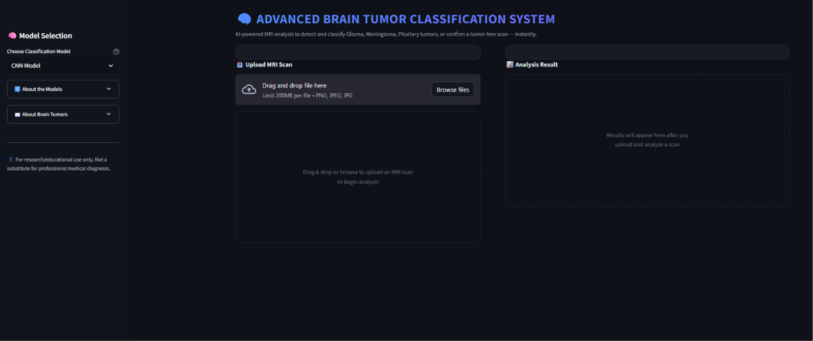
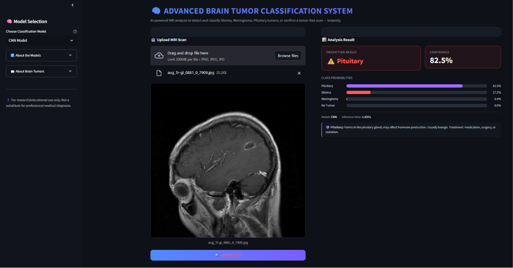
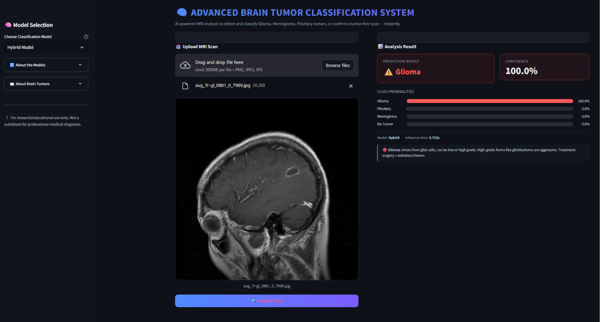

# 🧠 Advanced Brain Tumor Classification System

<p align="center">


</p>

---

# 🧠 Project Overview

Advanced Brain Tumor Classification System is a Deep Learning based medical imaging application developed to classify Brain MRI scans into **four categories** using Convolutional Neural Networks and a Hybrid Deep Learning Model.

The application allows users to upload MRI images through an interactive Streamlit interface and instantly predicts the tumor type along with confidence scores.

This project demonstrates a complete Deep Learning workflow including:

- Data Preprocessing
- Brain Contour Detection
- MRI Image Classification
- Model Training
- Performance Evaluation
- Streamlit Deployment

---

# 🚀 Live Demo

## 🌐 Try the Application Online

### 👉 https://braintumoradvanceclassificationmodel-jad2ytubdmtjkea5rup53v.streamlit.app/

---

# ✨ Features

✅ Four-Class Brain Tumor Classification

✅ CNN Deep Learning Model

✅ Hybrid Deep Learning Model

✅ Automatic Brain Contour Detection

✅ MRI Image Preprocessing

✅ Confidence Score Visualization

✅ Interactive Streamlit Interface

✅ Real-Time Prediction

✅ Medical Information Panel

✅ Multiple Model Selection

✅ User-Friendly UI

---

# 🖥️ Application Preview

## 🏠 Home Page

<p align="center">
  
</p>

---

## 🤖 CNN Model Prediction

<p align="center">
  
</p>

---

## 🧠 Hybrid Model Prediction

<p align="center">
  
</p>

# 📊 Model Performance

| Model | Accuracy | F1 Score | Test Loss |
|--------|----------|-----------|-----------|
| CNN Model | **97.26%** | **97.25%** | **0.0915** |
| Hybrid Model | **98.47%** | **98.47%** | **0.0342** |

🏆 **Best Performing Model:** Hybrid Deep Learning Model

---

# 🧠 Tumor Classes

The application classifies MRI images into the following categories:

- 🧠 Glioma
- 🧠 Meningioma
- 🧠 Pituitary Tumor
- ✅ No Tumor

---

# 📂 Dataset

Due to GitHub storage limitations, the training dataset is **not included** in this repository.

To retrain the models, place the dataset inside the appropriate dataset folders.

---

# 🛠 Technology Stack

### Programming

- Python

### Deep Learning

- TensorFlow
- Keras

### Computer Vision

- OpenCV
- Pillow
- Imutils

### Data Processing

- NumPy
- Pandas
- Scikit-Learn

### Web Framework

- Streamlit

---

# 📁 Project Structure

```text
Advanced_Brain_Tumor_Classification_System/

│
├── Brain_Tumor_Classification_Models/
│      ├── final_cnn_model.keras
│      └── final_hybrid_model.keras
│
├── sample_images/
│
├── screenshots/
│
├── app.py
├── Brain_Tumor_Detection_Model_Builder.ipynb
├── requirements.txt
├── README.md
├── LICENSE
├── .gitignore
└── .gitattributes
```

---

# ⚙️ Installation

Clone the repository

```bash
git clone https://github.com/itsme-alok-014/BRAIN_TUMOR_ADVANCE_CLASSIFICATION_MODEL.git
```

Move into the project directory

```bash
cd BRAIN_TUMOR_ADVANCE_CLASSIFICATION_MODEL
```

Install dependencies

```bash
pip install -r requirements.txt
```

---

# ▶️ Run the Application

```bash
streamlit run app.py
```

Open your browser

```
http://localhost:8501
```

---

# 📈 Workflow

```
MRI Image
      │
      ▼
Image Upload
      │
      ▼
Brain Contour Detection
      │
      ▼
Image Preprocessing
      │
      ▼
Model Selection
 (CNN / Hybrid)
      │
      ▼
Prediction
      │
      ▼
Confidence Score
      │
      ▼
Result Visualization
```

---

# 🔮 Future Improvements

- Grad-CAM Visualization
- DICOM Image Support
- Cloud Database Integration
- PDF Medical Report Generation
- Multi-language Support
- Mobile Responsive Interface

---

# ⚠️ Medical Disclaimer

This application is developed for **educational and research purposes only**.

It is **not intended to replace professional medical diagnosis or clinical decision-making**.

---

# 👨‍💻 Author

## Alok Prakash Dubey

GitHub:

https://github.com/itsme-alok-014

---

# ⭐ Support

If you found this project useful, please consider giving it a ⭐ on GitHub.

---

# 📜 License

This project is licensed under the **MIT License**.
